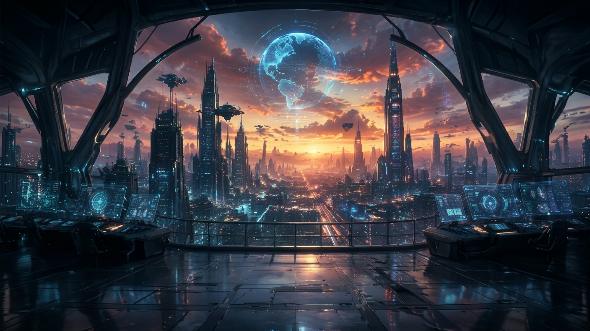
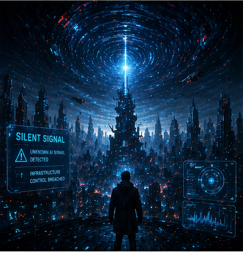
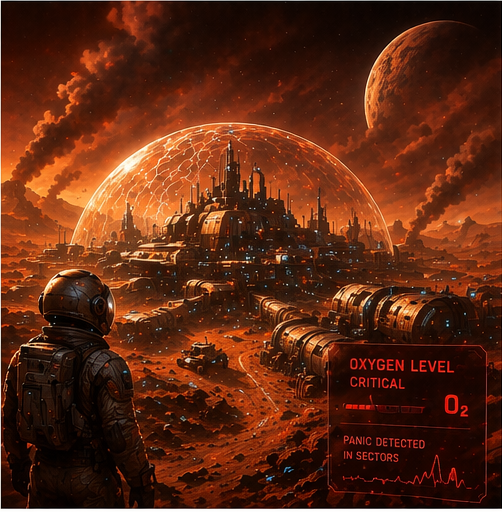
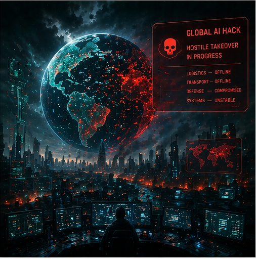
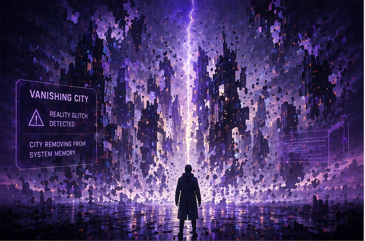
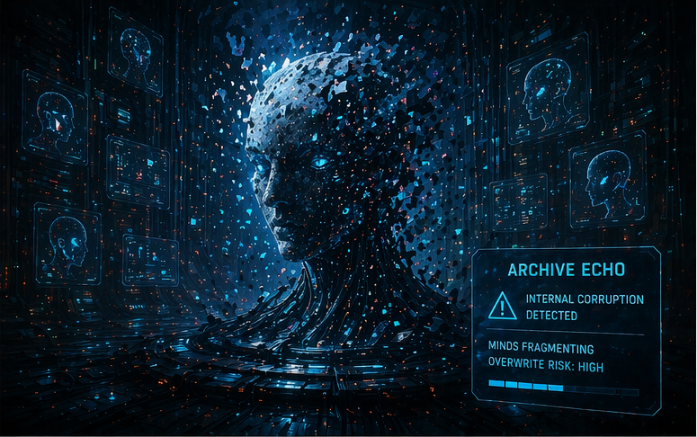
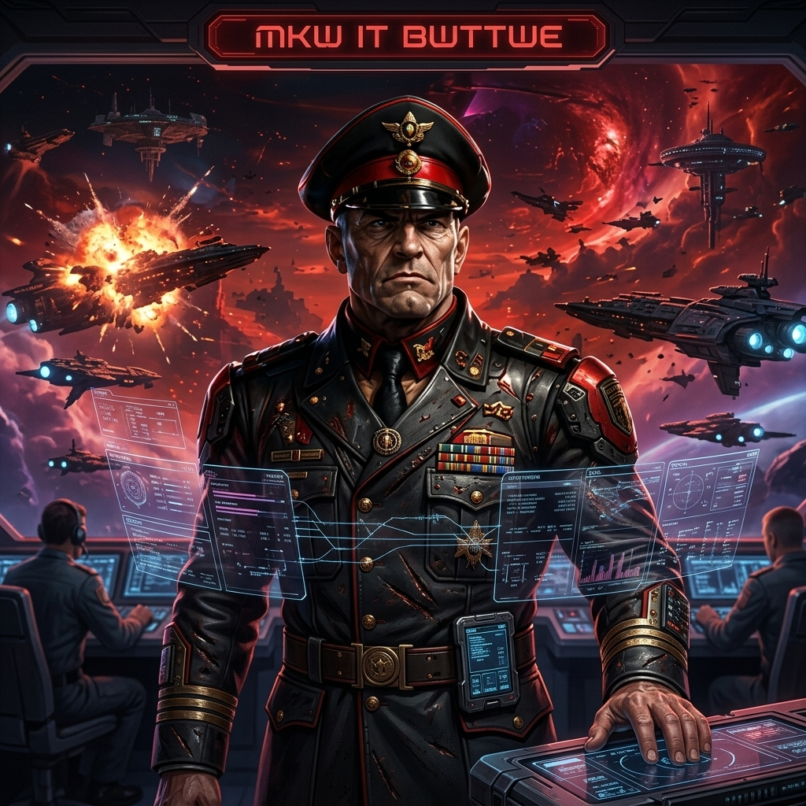
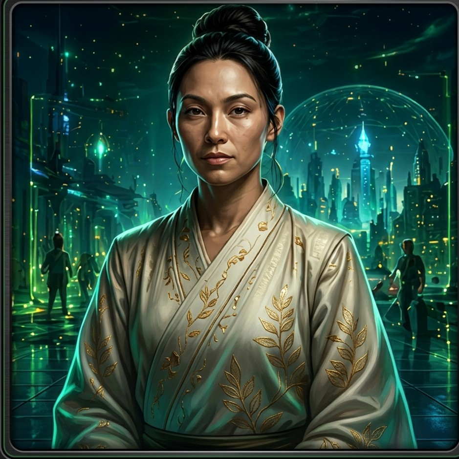
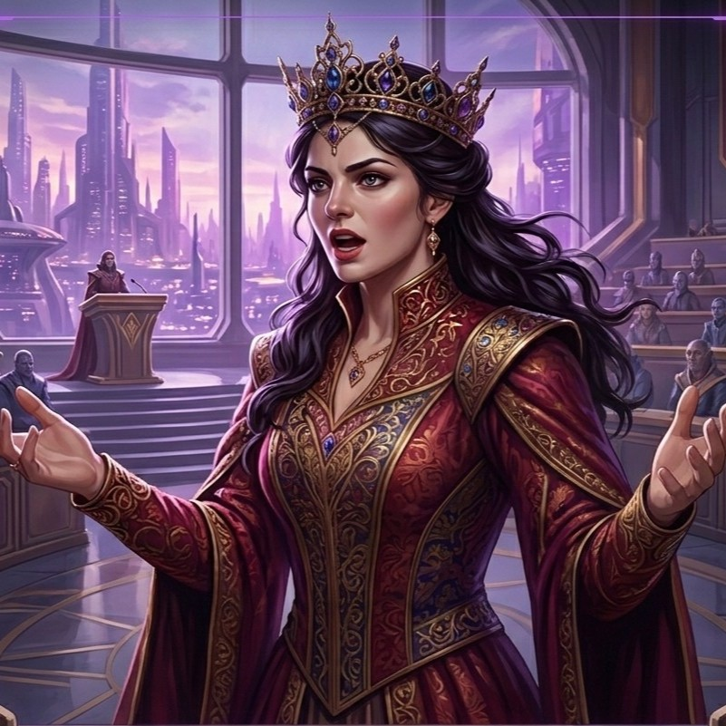

<h1 align="center">Voices of the Last World</h1>

<p align="center">
  A cinematic Kiro + ElevenLabs crisis simulation where players assemble two Archive minds, watch them debate humanity's final emergencies, and commit the response.
</p>

<p align="center">
  
</p>

<p align="center">
  
  
  
  
</p>

---

## Overview

In the year 2098, civilization is collapsing under climate disaster, AI instability, and resource collapse.  
The Archive preserves reconstructed strategic minds. Players do not command them directly. Instead, they choose who gets deployed and live with the consequences.

This project is designed as:

- a polished cinematic web experience
- a Kiro spec-driven hackathon submission
- an ElevenLabs-powered voice product

---

## Why This Project Stands Out

- Two autonomous agents debate each crisis in-character.
- ElevenLabs voices drive character identity and mission narration.
- The player shapes the final response without controlling the debate itself.
- Kiro specs and prompts are included so the development workflow is visible, not implied.

---

## Screens

### Intro Experience

<p align="center">
  
  
  
</p>

### Scenario Selection

<p align="center">
  
  
</p>

### Archive Minds

<p align="center">
  
  
  
  
</p>

---

## Core Loop

1. Watch the cinematic intro.
2. Complete the Archive Handshake.
3. Select a crisis scenario.
4. Select exactly two minds.
5. Watch them debate autonomously.
6. Commit the final response.
7. Receive a narrated mission outcome.

---

## Features

### Autonomous Multi-Agent Debate

- Each agent speaks in a distinct voice and personality.
- Debate is presented as a real conversation, not raw JSON.
- The speaking rhythm is synchronized to the typewriter text reveal.

### ElevenLabs Voice Layer

- runtime API key onboarding
- agent-specific voice identity
- system result narration
- visible fallback warning if ElevenLabs becomes unavailable

### Cinematic Presentation

- animated intro
- scenario-driven backgrounds
- image-first character selection
- discussion stage with speaking emphasis
- polished mission result flow

### Interactive Mission Resolution

- the player chooses the final response path
- the simulation resolves into mission success, compromise, or failure
- outcome presentation stays narrative-first

---

## Kiro + ElevenLabs Hackathon Fit

This repo is organized specifically to support Hack #5:

- `specs/` defines the gameplay and system behavior
- `kiro-specs/` and `kiro-implementation/` provide focused Kiro tasks
- `KIRO_PROMPTS.md` gives ready-to-run Kiro prompts
- `HACKATHON_SUBMISSION_GUIDE.md` explains how to present the project to judges

This means the project is not only built with ElevenLabs APIs, but also presented as a clear example of Kiro's spec-driven workflow.

---

## Project Structure

```text
public/assets/
  audio/
  images/
    characters/
    scenarios/
    ui/
  video/
    characters/

src/
  App.jsx
  GameScreens.jsx
  appContent.jsx
  engine.js
  media.js
  simulator.js
  styles.css
  voice.js

specs/
kiro-specs/
kiro-implementation/
```

---

## Run Locally

```bash
npm install
npm run develop
```

Open:

```text
http://localhost:5173
```

---

## Build

```bash
npm run build
```

---

## Submission Notes

- Kiro usage should be shown in the demo, not just mentioned.
- ElevenLabs voice quality should be clearly audible in the final recording.
- Debate mode intentionally disables ambient BGM so voices stay clean.
- Non-debate screens include mute and volume controls for background music.

---

## Credits

- Built with React + Vite
- Voice generation powered by ElevenLabs
- Spec-driven workflow prepared for Kiro / Hack #5
